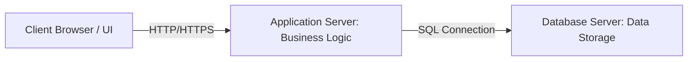
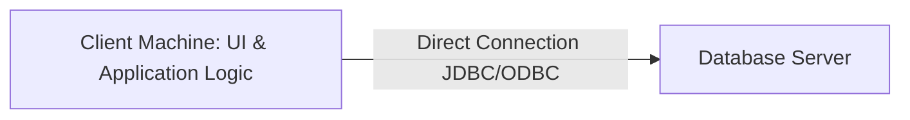

# Chapter 1: Introduction to DBMS & System Architecture (Lectures 1 - 15)

This chapter covers the foundational concepts of Database Management Systems, contrasts them with traditional file systems, and details schemas, levels of abstraction, data independence, architectures, and classifications.

---

## Lecture 1: Syllabus & Course Introduction

### 1. Real-World Analogy (Why DBMS is Needed)
*   **Manufacturing Example**: Consider a pen/pencil manufacturing company. Merely manufacturing the product is not enough. You must record and track detailed data for operations (e.g., length, color, manufacturing date, cost/price, QR/barcodes, and physical batch location).
*   **Handling Customer Complaints**: If a customer reports a faulty item, the company uses stored barcode data to trace the product back to its specific batch, production date, and raw material vendor to fix the root cause.
*   **Accountability & Transparency**: Storing structured historical data across all departments (HR, Accounts, Logistics, Sales, R&D) ensures operational transparency and organizational accountability.

### 2. Target Audience
*   **Undergraduate Students**: Computer Science (CS) and Information Technology (IT) engineering students taking university-level DBMS courses.
*   **Competitive Exam Aspirants**: Candidates preparing for examinations like GATE, ISRO, or technical PSU assessments.
*   **Career Aspirants**: Individuals seeking positions in data engineering, backend software development, Data Analysis, or Business Analysis.

### 3. Syllabus Overview (14 Core Chapters)
The curriculum is organized into 14 key chapters:
1.  Introduction to RDBMS
2.  Relational Database Concepts
3.  Database Design & ER Model
4.  Basics of SQL
5.  Advanced SQL Features (Procedures, Triggers, Functions)
6.  Formal Relational Query Languages & Relational Algebra
7.  Normalization & Functional Dependencies
8.  Storage and File Structures
9.  Indexing and Hashing
10. Query Processing & Optimization
11. Transactions & Concurrency Control
12. Database System Architectures
13. Data Warehousing & Data Mining
14. XML & Advanced Databases

### 4. Career Opportunities (Scope)
*   **Database Administrator (DBA)**: Complete privilege, maintenance, tuning, and access control over database systems.
*   **Full Stack Developer / Backend Developer**: Core database knowledge needed to build APIs and backend application structures.
*   **Other Roles**: Data Analyst, Business Analyst, Software Tester, and Security/Penetration Tester.

---


## Lecture 2: Introduction to Database & DBMS

### 1. Definition of DBMS
*   **Core Definition**: A Database Management System (DBMS) is a collection of interrelated data and a set of programs to access (retrieve) those data.
*   **Interrelated Data**: Data is stored in structured formats (such as tables with rows and columns) where the data in a particular row is logically connected to a specific item or real-world entity.
*   **Storage and Access**: A DBMS is not just for storing data permanently—it provides a set of programs to retrieve or fetch that data conveniently and efficiently (e.g., retrieving account details instantly at an ATM machine).

### 2. Key Features and Goals of DBMS
*   **Convenience and Efficiency**: DBMS provides convenient and efficient ways to store and retrieve data compared to traditional file systems.
*   **Handling Large Volumes of Data**: It is designed to manage massive amounts of data for organizations while keeping track of all changes and concurrent transactions.
*   **Data Storage Structures**: Defines simple or complex data structures capable of handling various types of data, including multimedia (audio, video, animations).
*   **Data Manipulation**: Provides mechanisms to insert, update, or edit data accurately (e.g., updating a phone number or address).
*   **Safety and Security**: Protects sensitive data from unauthorized access, security threats, or system failures.

### 3. Difference Between Data and Information
*   **Data (Raw Facts)**: Unprocessed facts or raw information with no context.
    *   *Example*: `25, Raghav, Nagpur` (without context, these are just strings and numbers).
*   **Information (Processed Data)**: Data that has been processed, structured, and organized to give a meaningful context.
    *   *Example*: `"Raghav is 25 years old and resides in Nagpur."`

### 4. What is Metadata?
*   **Definition**: Metadata is data about data.
*   **Example**: For a document or media file stored on a system, the metadata includes the author's name, creation date, last modified date, and file size. For a database, it includes table definitions, data types, and primary key constraints.

---

## Lecture 3: Key Applications of Database Management Systems (DBMS)
*   **Sales**: Stores details regarding customers, products, and purchases across grocery stores, pharmacies, supermarkets, and fashion outlets.
*   **Finance**: Manages financial records, sales of stocks or bonds, online trading details, and stock market transactions.
*   **Banking**: Maintains customer profiles, account details, loan records, transactions, credit card information, and asset details.
*   **Schools, Colleges & Universities**: Stores student records, grades, course details, as well as teaching and non-teaching staff information for long-term tracking.
*   **Manufacturing**: Manages supply chain details, including production items, warehouse inventory levels, store allocations, and purchase/sales orders.
*   **Online Stores**: Handles online order tracking, user login credentials, product reviews, and recommendation systems for e-commerce platforms like Amazon and Flipkart.
*   **Railway Reservation**: Stores Passenger Name Records (PNR), passenger details, train schedules, seat reservations, route maps, and staff records.
*   **Airlines**: Keeps track of flight schedules, passenger bookings, reservation statuses, route options, and employee management.
*   **Human Resources (HR)**: Manages employee profiles, salaries, payroll processing, tax deductions, and employee benefits.
*   **Telecommunication**: Tracks customer records, call history, prepaid/postpaid plan details, recharge histories, and billing amounts.
*   **Insurance**: Stores policy details, policyholders and nominee information, payment histories, and claim settlements.

---

## Lecture 4: Key Drawbacks of File Systems vs. DBMS

### 1. File System vs. DBMS Comparison Table
| Feature | Traditional File System | DBMS |
| :--- | :--- | :--- |
| **Data Structure** | Tightly coupled with the application program. | Stored independently in a system catalog. |
| **Redundancy** | High (same details stored across different departments). | Minimized through normalization and joins. |
| **Concurrency** | Difficult to lock specific records; files are locked. | Granular locks (row/page/table level) via transactions. |
| **Security** | Coarse-grained OS-level file permissions. | Fine-grained roles, views, and row-level access control. |

### 2. Seven Key Drawbacks of File Systems
1.  **Data Redundancy and Inconsistency**:
    *   **Redundancy**: Different programmers and applications create duplicate files, which increases storage costs and makes searching and accessing data more difficult.
    *   **Inconsistency**: Updating a record in one file or location does not automatically update it elsewhere. This leads to conflicting data across files. A DBMS handles this seamlessly by propagating updates.
2.  **Difficulty in Accessing Data**:
    *   Extracting specific information (e.g., listing employees earning more than $50,000 or filtering students by city and credits) requires manual search or custom code in a file system.
    *   A DBMS allows fast, flexible, and convenient data retrieval using declarative query languages like SQL.
3.  **Data Isolation**:
    *   Files are scattered across various formats, folders, and directories, making it difficult to isolate or consolidate data.
    *   A DBMS consolidates all data into a centralized database for simplified retrieval and automated backups.
4.  **Integrity Problems**:
    *   File systems cannot natively enforce validation rules (e.g., ensuring a salary is non-zero or that an ID contains only digits).
    *   A DBMS allows users to enforce strict constraints (like non-zero bank balances) easily across single or multiple tables.
5.  **Atomicity Problems**:
    *   File systems struggle with "all-or-nothing" execution. If a failure occurs mid-transaction (e.g., money is debited from Account A but not credited to Account B during a fund transfer), the data remains corrupted.
    *   A DBMS ensures atomicity by automatically rolling back partial executions to restore system consistency upon failure.
6.  **Concurrent Access Anomalies**:
    *   When multiple users access and modify shared files simultaneously, it can result in incorrect overwrites or force files into read-only modes.
    *   A DBMS handles concurrent access seamlessly without causing data inconsistencies.
7.  **Security Problems**:
    *   File systems offer basic access restrictions (like password-locking an entire file) but cannot easily restrict access to specific rows or columns.
    *   A DBMS allows fine-grained access control, creating specific views and privileges based on user roles (e.g., Database Administrator vs. regular user).

---

## Lecture 5: Three-Tier Architecture

### 1. Introduction to Three-Tier Architecture
*   **Overview**: A software architecture predominantly used for client-server applications where the components are divided into three logically and physically separate tiers.
*   **Key Advantages**:
    *   **Independent Infrastructure**: Each tier runs on its own environment or server.
    *   **Faster Development**: Tiers can be developed, tested, and maintained simultaneously by different teams.
    *   **Scalability & Security**: Each tier can be updated, scaled, and secured independently without affecting other tiers.



### 2. The Three Tiers Explained
*   **A. Presentation Tier (Client / Front-End)**:
    *   **Role**: The topmost level that directly interacts with the end-user.
    *   **Function**: Collects input data from users and displays information back to them (e.g., mobile banking apps or web browsers).
    *   **Technologies Used**: HTML, CSS, JavaScript, Desktop GUI frameworks.
*   **B. Application Tier (Middle Tier / Web Server)**:
    *   **Role**: The heart of the system containing all the business logic, processing rules, and transaction computations.
    *   **Function**: Processes user inputs from the front-end and communicates with the back-end database using API calls.
    *   **Technologies Used**: Python, Java, PHP, Perl, Ruby.
*   **C. Data Tier (Database / Back-End)**:
    *   **Role**: The bottom-most tier where physical data storage and management occur.
    *   **Function**: Stores and manages records permanently via Database Management Systems (DBMS). It does not interact directly with the client-tier in a three-tier architecture.
    *   **Technologies Used**: MySQL, Oracle, PostgreSQL, MS SQL Server, MongoDB, Cassandra.

### 3. General Abstraction Levels
*   **External / View Level**: Maps to the topmost tier (Presentation Tier) offering multiple views to end-users based on their roles.
*   **Conceptual Level**: Maps to the middle tier (Application Tier) where business rules and logical structures are defined.
*   **Internal Level**: Maps to the bottom-most tier (Data Tier) where physical database storage at the bottom occurs.

---

## Lecture 6: Data Abstraction & Three Levels of Abstraction

### 1. Data Abstraction & Real-World Analogy
*   **Concept**: Data abstraction refers to hiding complex system details from users and showing only the relevant, essential information.
*   **Milk Vendor Analogy**: When asking a milk delivery agent for the reason behind a delay, you only want a quick, clear explanation (e.g., "the alarm didn't go off") rather than a long, unnecessary recount of their entire morning schedule. Similarly, database systems hide internal storage complexities from end-users.

### 2. The Three Levels of Abstraction
*   **A. Physical Level (Lowest Level)**:
    *   **Description**: The bottom-most level that describes how the data are actually stored in physical storage media (e.g., HDDs, SSDs).
    *   **Details**: Uses complex, low-level data structures to manage physical storage (such as managing raw files and multimedia formats).
*   **B. Logical Level (Middle Level)**:
    *   **Description**: The middle level that describes what data are stored in the database and what relationships exist among them.
    *   **Details**: Uses relatively simpler data structures compared to the physical level. Managed primarily by Database Administrators (DBAs).
    *   **Physical Data Independence**: The logical layer is independent of the physical layer, meaning changes made to the logical structure do not require rewriting the underlying physical storage structures.
*   **C. View Level (Highest Level)**:
    *   **Description**: The topmost level that describes only a part of the entire database relevant to a specific user or role.
    *   **Details**:
        *   Provides simplified interactions via web browsers, mobile apps, or Graphical User Interfaces (GUIs).
        *   Hides complex logical rules and physical storage mechanics from end-users.
    *   **Multiple Views & Security**: Different users get different views of the same database based on access privileges (e.g., an ATM user only sees their own account details, whereas a bank manager or regional manager sees broader administrative data).

---

## Lecture 7: Schema and Instance

### 1. Programming Analogy
To build a clear foundational understanding, database concepts can be compared to basic variable declarations in programming languages like C:
*   **Variable Declaration / Structure $\rightarrow$ Schema**:
    *   When a programmer writes `int a;`, the data type (Integer) and its allocated memory size (e.g., 2 bytes / 16 bits) are fixed.
    *   The structure of the variable does not change during program execution.
*   **Variable Value $\rightarrow$ Instance**:
    *   The value inside `a` can change dynamically (e.g., modified from 20 to -5 or 0) based on program execution.
    *   The value is temporary and exists only within the current execution scope.

### 2. Deep Dive: What is a Schema?
*   **Definition**: A Schema is the overall design or structural framework of a database.
*   **Database Basics**: A database consists of multiple tables, where each table stores data organized into rows and columns.
*   **Key Characteristics of Schemas**:
    *   **Infrequent Changes**: Once designed according to application requirements, a schema is rarely changed or modified.
    *   **Role of DBA**: If a structural modification is ever necessary, it is exclusively done by the Database Administrator (DBA).
*   **Examples of Schemas**:
    *   **Type Definition Example**:
        ```pascal
        type Student = record
            Rollno : numeric (5);
            Name   : char (25);
            Class  : char (10);
        end;
        ```
        *   `Rollno`: Numeric type, max length of 5 digits.
        *   `Name`: Character type, max length of 25 characters.
        *   `Class`: Character type, max length of 10 characters.
    *   **Real-World University Database Schemas**:
        *   `Department` Table: Fields like `Dept_Name`, `Building`, `Budget`, and `HOD_Name`.
        *   `Course` Table: Fields like `Course_ID`, `Title`, `Dept_Name`, and `Credits`.
        *   `Student` Table: Fields like `Roll_No`, `Name`, `Dept_Name`, and `Total_Credits`.
*   **Data Abstraction Connection**:
    *   At the physical level, tables are stored as blocks of consecutive memory locations.
    *   Database systems hide these low-level physical details from programmers (Data Abstraction).
    *   DBAs remain aware of these physical storage details because of their administrative responsibilities.

### 3. Deep Dive: What is an Instance?
*   **Definition**: An Instance is the actual collection of data stored in the database at a specific point in time.
*   **Key Characteristics**:
    *   **Dynamic Nature**: Unlike the fixed schema, the database instance changes constantly as records are inserted, updated, or deleted.
    *   **Database Growth**: These operations cause the database size to grow or shrink over time.
*   **Real-World Example**:
    *   *Today ($T_1$)*: A university database contains 1,000 student records (Instance at $T_1$).
    *   *Tomorrow ($T_2$)*: 100 new students are admitted, bringing total records to 1,100 (Instance at $T_2$).
    *   The schema (table structure) remains identical, but the instance has changed.

### 4. Schemas Across Levels of Abstraction
Database schemas are mapped onto the 3-level database abstraction architecture:
```text
+---------------------------------------+
|             Sub-schemas               |  <-- View Level (Multiple external views)
+---------------------------------------+
                    |
+---------------------------------------+
|            Logical Schema             |  <-- Logical Level (Data structures & relationships)
+---------------------------------------+
                    |
+---------------------------------------+
|            Physical Schema            |  <-- Physical Level (Actual physical storage)
+---------------------------------------+
```
*   **Sub-schemas (View Level)**: Defines customized presentation views tailored for specific end-users/subscribers.
*   **Logical Schema**: Defines tables, fields, entities, and logical relationships as coded in application software.
*   **Physical Schema**: Defines how data is actually physically organized and stored on disk/storage media.

---

## Lecture 8: Database Users

### 1. Overview of Database Users
The users of a Database Management System (DBMS) are categorized into 4 primary types based on their technical background, how they interact with the system, and their level of expertise:
*   Naive Users (Unsophisticated Users)
*   Application Programmers
*   Sophisticated Users
*   Specialized Users
*(Note: The Database Administrator or DBA is a fifth key role with complete administrative privileges over the entire system).*

### 2. Naive Users (Unsophisticated Users)
*   **Definition**: Users who lack database knowledge and have no understanding of the technical details or inner workings of a DBMS. However, they interact with the database system frequently.
*   **How They Interact**:
    *   They do not write SQL queries or write code.
    *   They interact with the system purely by invoking pre-written application programs via graphical user interfaces (Web apps, Mobile apps, Desktop interfaces).
*   **Examples**:
    *   **Bank Clerks / Tellers**: Enter customer account details or check balances using pre-built software interfaces.
    *   **ATM Users**: Withdraw money or check account balances via a touchscreen interface without needing to know SQL.
    *   **Online Ticket Booking**: Booking train, flight, or movie tickets through mobile apps or websites.

### 3. Application Programmers
*   **Definition**: Computer professionals and software developers who specialize in writing software applications.
*   **Role & Responsibilities**:
    *   Write the application code, business logic, and user interfaces that Naive Users interact with.
    *   Use programming languages (e.g., Java, C++, Python) combined with database connectivity tools (e.g., JDBC, ODBC).
    *   Build user-friendly interfaces (Web/Mobile UI).
*   **Tools Used**:
    *   Rapid Application Development (RAD) tools to speed up interface and software creation.

### 4. Sophisticated Users
*   **Definition**: Tech-savvy users who understand database structure and interact with the DBMS without writing standard application programs.
*   **How They Interact**:
    *   Formulate requests using database query languages (such as SQL) directly through command-line interfaces or query processors.
    *   Use data analysis software to evaluate and analyze large datasets stored in the database.
*   **Examples**:
    *   **Data Analysts & Business Analysts**: Perform analytical queries to draw insights for business decisions.
    *   **Database Administrators (DBAs)**: Execute queries directly to maintain and structure the database.

### 5. Specialized Users
*   **Definition**: Users with specialized technical skill sets who write non-traditional database applications that don't fit into the conventional relational model.
*   **Key Domains & Applications**:
    *   **Computer-Aided Design (CAD) Systems**: Managing complex engineering and 3D design databases.
    *   **Knowledge Base & Expert Systems**: Working with artificial intelligence systems to store rules and inference mechanisms.
    *   **Multimedia Databases**: Handling non-textual data like audio, video, graphics, images, and animations.
    *   **Next-Generation Systems**: Developing future-ready database solutions for complex environment deployments.

### 6. Summary & Preview: Database Administrator (DBA)
*   **Overview**: The Database Administrator (DBA) is the most crucial administrative user who possesses administrative privileges over the entire database system.
*   **Responsibilities**: Complete authority over data access, schema definition, security, and administrative management.

---

## Lecture 9: Database Administrator (DBA)

### 1. Introduction to the Database Administrator (DBA)
*   **Definition**: The DBA is a central figure in any organization using a database system who holds complete and central control over both the database system and the programs accessing it.
*   **Centralized Authority**:
    *   Databases act as a single centralized unit rather than being distributed across individual user machines.
    *   The DBA is the sole authority granted full elevated privileges over this central database.
    *   Without a DBA, managing system-wide access, security, and maintenance is practically impossible.

### 2. Core Functions of a DBA
The DBA's responsibilities are divided into 5 primary functions:
*   **Function 1: Schema Definition**:
    *   *Role*: The DBA designs and establishes the overall structural framework (schema) of the database.
    *   *Tools Used*: Authorized to write and execute Data Definition Language (DDL) commands in SQL (such as `CREATE TABLE`, `ALTER TABLE`).
    *   *Scope*: Defines table structures, column definitions, data types, and structural relationships.
*   **Function 2: Storage Structure & Access Method Definition**:
    *   *Role*: Decides how data is organized physically on storage devices and how users/programs access that data.
    *   *Scope*: Configures storage layouts on disk drives and specifies permitted or restricted data access methods.
*   **Function 3: Schema & Physical Organization Modification**:
    *   *Role*: Performs modifications to the database structure (logical schema) or low-level storage layout whenever organizational requirements change.
    *   *Scope*: Alters table designs, updates indexing structures, or shifts physical data layouts to adapt to growing business needs.
*   **Function 4: Granting Authorization for Data Access**:
    *   *Role*: Controls security by enforcing the principle of Authorization ("Who can access what").
    *   *Scope*: Assigns role-based permissions across various organizational levels:
        *   **Bank Teller / Clerk**: Access limited to basic transaction and account balance lookup.
        *   **Bank Manager**: Higher privileges to view sensitive reports or authorize large transactions.
        *   **End Users / Customers**: Access limited purely to personal account information.
*   **Function 5: Integrity Constraint Specification**:
    *   *Role*: Defines integrity constraints (e.g., checks, keys) that the data must satisfy.

### 3. Routine Maintenance Activities
In addition to core structural responsibilities, the DBA manages day-to-day database health through three vital routine tasks:
1.  **Periodic Backups**:
    *   *Hardware & Software Failures*: Hard drives, SSDs, or database software can crash unexpectedly. Periodic backups ensure the data can be fully restored.
    *   *Natural Calamities*: Disasters like floods or earthquakes can destroy physical data centers. DBAs maintain off-site/remote backups to guarantee disaster recovery.
2.  **Disk Space Management**:
    *   *Storage Allocation*: Databases expand rapidly as new users register and new transactions accumulate.
    *   *Role*: The DBA continuously monitors available disk space to prevent storage exhaustion and system crashes.
3.  **Performance Tuning & Monitoring**:
    *   *Response Speed*: Database systems must execute queries and return results rapidly.
    *   *Example*: When withdrawing cash at an ATM, delays caused by sluggish query processing result in bad user experiences.
    *   *Role*: The DBA routinely audits underlying hardware performance and optimizes queries to maintain high throughput and minimal latency.

---

## Lecture 10: Database Languages (DDL, DML, DCL, TCL)
*   **DDL (Data Definition Language)**: Used by DBAs and designers to define schemas and constraints. The DDL compiler generates metadata stored in the data dictionary.
    *   *Commands*: `CREATE`, `ALTER`, `DROP`, `TRUNCATE`.
*   **DML (Data Manipulation Language)**: Used to query, insert, update, and delete database records.
    *   *Procedural DML*: User specifies *what* data is needed and *how* to get it (e.g., Relational Algebra).
    *   *Non-Procedural DML*: User specifies *what* data is needed without describing how to get it (e.g., SQL).
*   **DCL (Data Control Language)**: Used to configure permissions and authorizations (`GRANT`, `REVOKE`).
*   **TCL (Transaction Control Language)**: Used to manage transaction execution states (`COMMIT`, `ROLLBACK`, `SAVEPOINT`).

---


## Lecture 11: Physical Data Independence
*   **Concept**: The ability to modify the physical/internal schema without affecting the conceptual schema or the external applications.
*   **Usage**: If we move the database to a new hard drive, change index structures (e.g., from B+ Tree to Hash index), or partition a file, the logical tables remain unchanged. The application code executing queries continues to work without modification.

---

## Lecture 12: Logical Data Independence
*   **Concept**: The ability to modify the conceptual schema (logical table structures, constraints) without changing the external schemas or application programs.
*   **Usage**: If we split an existing table into two or add a new attribute to a relation, we can define a view that reconstructs the old table structure. This ensures that old application programs referencing the table do not break.

---

## Lecture 13: Schema Mappings
*   **Concept**: The process of transforming requests and results between different levels of the three-schema architecture.
*   **Conceptual-to-Internal Mapping**: Translates conceptual queries (e.g., `SELECT * FROM student`) into internal disk block operations and index searches.
*   **External-to-Conceptual Mapping**: Translates user-view queries on virtual views into queries on the actual logical tables.
*   **Importance**: When a schema at one level changes, only the mapping to the adjacent level needs modification. The schemas at other levels remain untouched.

---

## Lecture 14: Database Architectures Overview
*   **Centralized DBMS Architecture**: All database software, data storage, and processing client programs run on a single machine (e.g., a mainframe server). Easy to manage but creates performance bottlenecks.
*   **Client-Server DBMS Architecture**: Workloads are distributed between the client machine (runs user interface and local application logic) and the database server machine (handles query optimization, transactional safety, and disk storage).

---

## Lecture 15: 2-Tier Architecture
*   **Concept**: The client application runs directly on the user's machine and communicates directly with the database server using network connection protocols (e.g., JDBC or ODBC).



*   **Pros**: Direct and simple communication.
*   **Cons**:
    1.  **Security**: Database credentials (connection strings) are often stored in the client-side code, creating vulnerabilities.
    2.  **Maintenance**: If business logic changes, the client application must be updated on every user machine.

---


## Lecture 16: Classification of DBMS
DBMS systems can be categorized based on their underlying data model:
1.  **Relational DBMS (RDBMS)**: Organizes data as a collection of two-dimensional tables (relations) with rows and columns. (e.g., PostgreSQL, MySQL, Oracle).
2.  **Object-Oriented DBMS (OODBMS)**: Stores data in the form of objects, matching Object-Oriented Programming (OOP) languages (e.g., db4o, ObjectDB).
3.  **Hierarchical DBMS**: Organizes data in a parent-child tree structure. A child node can have only one parent node (e.g., IBM Information Management System).
4.  **Network DBMS**: Organizes data in a graph structure. Unlike hierarchical models, a child node can have multiple parent nodes (e.g., Integrated Data Store).
