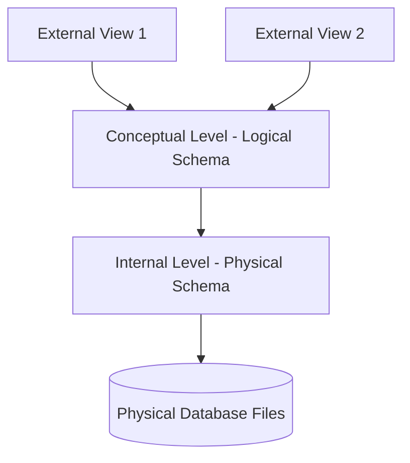

# Chapter 1: Introduction to DBMS & System Architecture (Lectures 1 - 15)

This chapter covers the foundations of Database Management Systems, contrasting them with traditional file systems, and dives deep into schemas, data independence, architectures, and system languages.

---

## Video 1: Syllabus & Course Introduction
### English
*   **Concept**: Introduction to the course structure, key topics (ER Model, Relational Model, Normalization, SQL, Transactions, Indexing), and the importance of DBMS in computer science curricula, GATE exams, and software engineering interviews.
*   **Takeaway**: Mastering DBMS is crucial for backend architecture, data consistency, and scalable system design.

### Tamil (தமிழ்)
*   **விளக்கம்**: இந்த பாடத்திட்டத்தின் அறிமுகம். ER மாடல், நார்மலைசேஷன், SQL, மற்றும் கன்சிஸ்டென்சி போன்ற முக்கிய தலைப்புகளின் மேலோட்டம். கேட் (GATE) தேர்வு மற்றும் இன்டர்வியூக்களில் இதன் முக்கியத்துவம் பற்றி Prabhu சார் விளக்குகிறார்.

---

## Video 2: What is a Database & DBMS?
### English
*   **Database**: A structured collection of logically related data.
*   **DBMS (Database Management System)**: A software package designed to define, create, maintain, manipulate, and control access to databases.
*   **Why DBMS?**: It provides a systematic, secure, and robust interface between application programs and database files.

### Tamil (தமிழ்)
*   **தரவுத்தளம் (Database)**: தர்க்கரீதியாக தொடர்புடைய தரவுகளின் முறையான தொகுப்பு.
*   **DBMS**: தரவுத்தளத்தை உருவாக்கவும், திருத்தவும், பாதுகாக்கவும் உதவும் ஒரு மென்பொருள் (உதாரணம்: Oracle, MySQL).
*   **ஏன் தேவை?**: கோப்புகளை ஒழுங்காகவும், பாதுகாப்பாகவும், ஒரே இடத்தில் சேமித்து அணுக இது தேவைப்படுகிறது.

---

## Video 3: Traditional File System vs. DBMS
### English
*   **File System**: Data is stored in individual flat files (like CSVs or TXT files) managed by the OS. Each department owns its own files, leading to isolation.
*   **DBMS**: Data is centralized, standardized, and shared. Metadata (description of data structure) is stored inside the database itself.

### Tamil (தமிழ்)
*   **கோப்பு முறைமை (File System)**: ஆப்பரேட்டிங் சிஸ்டம் மூலம் கோப்புகளைத் தனித்தனியாகச் சேமிப்பது.
*   **ஒப்பீடு**: ஃபைல் சிஸ்டத்தில் தரவு தனித்தனியாகக் கிடக்கும், ஆனால் DBMS-ல் அனைத்துத் தரவும் மையப்படுத்தப்பட்டு, ஒழுங்குபடுத்தப்பட்டு, அனைவராலும் பகிரப்படும் தன்மையைக் கொண்டிருக்கும்.

---

## Video 4: Drawbacks of Traditional File System
### English
*   **Data Redundancy & Inconsistency**: Same data stored in multiple places. If a student's address changes, it might be updated in the fee file but not in the library file.
*   **Data Isolation**: Files are in different formats; writing new applications to retrieve appropriate data is difficult.
*   **Integrity Problems**: Constraints (like `balance >= 0`) are hard-coded in applications rather than files.
*   **Concurrent Access Anomalies**: If two users book a seat at the same time, inconsistency arises.
*   **Security Problems**: Difficult to give partial access (e.g., allow a clerk to see names but not salaries).

### Tamil (தமிழ்)
*   **ஃபைல் சிஸ்டத்தின் குறைபாடுகள் (Ethuku DBMS?)**:
  1. **அதிகப்படியான தரவு (Redundancy)**: ஒரே முகவரி நூலகத்திலும், கல்லூரி அலுவலகத்திலும் தனித்தனியாக இருக்கும். ஒன்றில் மாற்றி மற்றொன்றில் மாற்ற மறந்தால் பிழை (Inconsistency) ஏற்படும்.
  2. **தனிமைப்படுத்தல் (Isolation)**: வெவ்வேறு கோப்புகள் வெவ்வேறு வடிவங்களில் இருக்கும்.
  3. **பாதுகாப்புக் குறைபாடு**: குறிப்பிட்ட சிலருக்கு மட்டும் பகுதித் தரவைக் காட்ட முடியாது.
  4. **ஒரே நேர அணுகல் சிக்கல் (Concurrency)**: ஒரே இருக்கையை இரண்டு பேர் ஒரே நேரத்தில் புக் செய்யும்போது குளறுபடி நடக்கும்.

---

## Video 5: Key Characteristics of DBMS
### English
*   **Self-describing nature**: Contains both data and the metadata (catalog/schema) defining it.
*   **Insulation between programs and data**: Data structures can change without requiring modifications to the application code (Data Independence).
*   **Support of multiple views**: Different users see different presentations of the same data.
*   **Sharing of data**: Multi-user transaction processing ensuring safety (ACID properties).

### Tamil (தமிழ்)
*   **DBMS-ன் சிறப்புகள் (Enna special?)**:
  * **சுய விளக்கத் தன்மை**: தரவு மற்றும் அதன் அமைப்பைக் காட்டும் மெட்டாடேட்டாவைக் கொண்டிருக்கும்.
  * **தரவு-மென்பொருள் தனிமை**: டேபிள் அமைப்பை மாற்றினாலும், கோடிங்-ஐ மாற்ற வேண்டியதில்லை.
  * **பலதரப்பட்ட பார்வைகள் (Multiple Views)**: மேலாளருக்கு ஒரு பார்வையும், வாடிக்கையாளருக்கு ஒரு பார்வையும் காட்டும்.

---

## Video 6: Database Users & DBA
### English
*   **Database Administrator (DBA)**: Controls the database schema, security authorizations, performance tuning, and backup/recovery.
*   **Naive Users**: Unsophisticated users interacting via pre-written applications (e.g., bank tellers, ticket booking customers).
*   **Sophisticated Users**: Analysts or engineers writing queries directly in query languages (SQL) without writing programs.
*   **Application Programmers**: Write host programs (C++, Java) that interact with the database.

### Tamil (தமிழ்)
*   **பயனர்கள்**:
  * **DBA (நிர்வாகி)**: முழுமையான பாதுகாப்பு, பேக்கப், மற்றும் அனுமதிகளை வழங்குபவர்.
  * **Naive Users**: பிரவுசர் அல்லது ஆப் மூலமாகப் பயன்படுத்தும் சாதாரண மக்கள் (ATM பயன்படுத்துபவர்).
  * **Sophisticated Users**: நேரடி SQL குவரிகளை எழுதும் ஆய்வாளர்கள்.
  * **அப்ளிகேஷன் புரோகிராமர்கள்**: டேட்டாபேஸை இணைக்கும் ஜாவா/பைதான் நிரல்களை எழுதுபவர்கள்.

---

## Video 7: Database Languages (DDL, DML, DCL, TCL)
### English
*   **DDL (Data Definition Language)**: Used to define database schema structures (e.g., `CREATE`, `ALTER`, `DROP`, `TRUNCATE`). Stores metadata in the Data Dictionary.
*   **DML (Data Manipulation Language)**: Used to retrieve and modify tuples (e.g., `SELECT`, `INSERT`, `UPDATE`, `DELETE`).
*   **DCL (Data Control Language)**: Manages permissions (e.g., `GRANT`, `REVOKE`).
*   **TCL (Transaction Control Language)**: Manages transactions (e.g., `COMMIT`, `ROLLBACK`).

### Tamil (தமிழ்)
*   **டேட்டாபேஸ் மொழிகள் (Eppati communication?)**:
  * **DDL**: அட்டவணை வடிவத்தை உருவாக்க (`CREATE`, `DROP`).
  * **DML**: தரவை மாற்றி அமைக்கவோ, பார்க்கவோ (`SELECT`, `INSERT`, `UPDATE`).
  * **DCL**: அனுமதி வழங்க மற்றும் பறிக்க (`GRANT`, `REVOKE`).
  * **TCL**: பரிவர்த்தனைகளைச் சேமிக்க (`COMMIT`, `ROLLBACK`).

---

## Video 8: Three-Schema Architecture (Levels of Abstraction)
### English
Designed to separate the user applications from the physical database structure.
1. **External Level (Individual Views)**: What the users see. Multiple external schemas representing different user views.
2. **Conceptual Level (Logical Schema)**: Describes what data is stored and relationship structures. Hidden physical detail.
3. **Internal Level (Physical Schema)**: Describes physical storage structures, files, indexes, and paths.

### Tamil (தமிழ்)
*   **முப்படி அடுக்குக் கட்டமைப்பு (Three-Schema)**:
  1. **வெளிப்புற நிலை (External Level)**: பயனர் பார்க்கும் திரை (UI Views).
  2. **கருத்தியல் நிலை (Conceptual Level)**: தரவுகளுக்கு இடையேயான உறவு மற்றும் அட்டவணைகளின் கட்டமைப்பு (Logical Schema).
  3. **உள்நிலை (Internal Level)**: ஹார்ட் டிஸ்க்கில் தரவு எவ்வாறு பைனரியாக, இன்டெக்ஸ்களாகச் சேமிக்கப்படுகிறது என்பதை விளக்கும் இயற்பியல் கட்டமைப்பு.

---

## Video 9: Physical Data Independence
### English
*   **Concept**: The ability to modify the physical/internal schema (e.g., changing file storage, rebuilding indexes, changing disk drives) without changing the conceptual/logical schema or user applications.
*   **Why**: Optimizing query speed using new index structures should not break user queries.

### Tamil (தமிழ்)
*   **இயற்பியல் தரவுச் சுதந்திரம்**:
  * **விளக்கம்**: ஹார்டு டிஸ்க் சேமிப்பு முறையையோ அல்லது குறியீடுகளையோ (Indexes) மாற்றினாலும், conceptual அட்டவணை அமைப்பையோ அல்லது அப்ளிகேஷன் குறியீடுகளையோ மாற்றத் தேவையில்லை.

---

## Video 10: Logical Data Independence
### English
*   **Concept**: The ability to modify the conceptual schema (e.g., adding a new table, splitting columns, adding attributes) without having to change the external schemas or existing application programs.
*   **Note**: Harder to achieve than physical data independence because application logic is tightly bound to logical data structures.

### Tamil (தமிழ்)
*   **தர்க்கரீதியான தரவுச் சுதந்திரம்**:
  * **விளக்கம்**: டேபிளில் புதிய காலம்களை (Columns) சேர்த்தாலோ அல்லது மாற்றினாலும், ஏற்கனவே இருக்கும் அப்ளிகேஷன்களைத் திருத்தத் தேவையில்லை.

---

## Video 11: Schema Mappings
### English
*   **Concept**: The process of transforming requests and results between the external, conceptual, and internal levels of the three-schema architecture.
    *   **Conceptual/Internal Mapping**: Translates conceptual queries into physical storage paths.
    *   **External/Conceptual Mapping**: Matches user-view queries to logical tables.
*   **Role**: Enables data independence. If a schema level changes, only the mapping needs update, not the other schemas.

### Tamil (தமிழ்)
*   **வரைபடம் (Mappings)**:
  * மூன்று அடுக்கு நிலைகளுக்கு இடையே தரவைக் கடத்தப் பயன்படும் மொழிபெயர்ப்பு முறை. அடுக்கு மாறும்போது மேப்பிங் மட்டுமே மாறும், பிற அடுக்குகள் பாதிக்கப்படாது.

---

## Video 12: Database Architectures Overview
### English
*   **Centralized**: DB runs on a single mainframe or server. Easy to administer, but forms a single point of failure and bottleneck.
*   **Client-Server**: Split workload. Client runs UI and application logic; Server handles database storage and query execution.

### Tamil (தமிழ்)
*   **கட்டமைப்பு வகைகள்**:
  * **மையப்படுத்தப்பட்ட (Centralized)**: ஒரே பெரிய சர்வரில் தரவுகள் இருக்கும்.
  * **கிளையண்ட்-சர்வர் (Client-Server)**: பயனர் கணினியும், தரவுத்தள சர்வர் கணினியும் பிரிந்து வேலை செய்யும் முறை.

---

## Video 13: 2-Tier Architecture
### English
*   **Concept**: The client application directly communicates with the database server on the backend.
*   **Example**: Using JDBC/ODBC connections from a desktop Java program to run queries on SQL Server.
*   **Pros**: Simple structure, fast response.
*   **Cons**: Security risk (client contains DB credentials), hard to update business logic across thousands of client machines.

### Tamil (தமிழ்)
*   **இரு அடுக்குக் கட்டமைப்பு (2-Tier)**:
  * பயனர் கணினி நேரடியாகத் தரவுத்தள சர்வருடன் தொடர்பு கொள்ளும் முறை (உதாரணம்: JDBC).
  * **குறைபாடு**: கிளையண்ட் மென்பொருளில் டேட்டாபேஸ் ரகசியக் குறியீடு இருப்பதால் பாதுகாப்பு குறைவு.

---

## Video 14: 3-Tier Architecture
### English
*   **Concept**: An intermediate layer called the **Application Server (Web Server)** sits between the Client and the Database Server.
    1. **Presentation Layer (Client)**: Browser interface.
    2. **Application Layer (App Server)**: Evaluates business logic, processes validation rules.
    3. **Database Layer (Data Server)**: Stores data and processes SQL transactions.
*   **Why**: Highly secure, scalable, easy to update business logic centralized in the Application server.

### Tamil (தமிழ்)
*   **மூவடுக்குக் கட்டமைப்பு (3-Tier)**:
  * கிளையண்ட் மற்றும் தரவுத்தளத்திற்கு இடையே ஒரு **அப்ளிகேஷன் சர்வர்** இருக்கும்.
  1. **பிரசன்டேஷன் (Client)**: பயனர் திரை.
  2. **அப்ளிகேஷன் சர்வர்**: பிசினஸ் லாஜிக் மற்றும் சரிபார்ப்புகளைச் செய்யும்.
  3. **டேட்டா சர்வர்**: தரவைச் சேமிக்கும்.
  * **நன்மை**: அதிக பாதுகாப்பு மற்றும் எளிய மேலாண்மை.

---

## Video 15: Classification of DBMS
### English
Based on data models:
1. **Relational DBMS (RDBMS)**: Data stored in tables (relations). (e.g., MySQL, Oracle, PostgreSQL).
2. **Object-Oriented DBMS (OODBMS)**: Stores data as objects (similar to OOP classes).
3. **Hierarchical DBMS**: Parent-Child tree structure (e.g., IBM IMS).
4. **Network DBMS**: Graph structure allowing multi-parent nodes.

### Tamil (தமிழ்)
*   **வகைப்பாடு**:
  1. **ரிலேஷனல் (RDBMS)**: அட்டவணை வடிவில் சேமிக்கும் முறை (உலகில் அதிகம் பயன்படுவது).
  2. **ஆப்ஜெக்ட்-ஓரியண்டட்**: OOP வகுப்புகளைப் போல தரவைச் சேமிப்பது.
  3. **படிநிலை (Hierarchical)**: பெற்றோர்-குழந்தை மரக் கிளை வடிவம்.
  4. **நெட்வொர்க்**: பல பெற்றோர்களைக் கொண்டிருக்க அனுமதிக்கும் வரைபடம் (Graph) வடிவம்.
