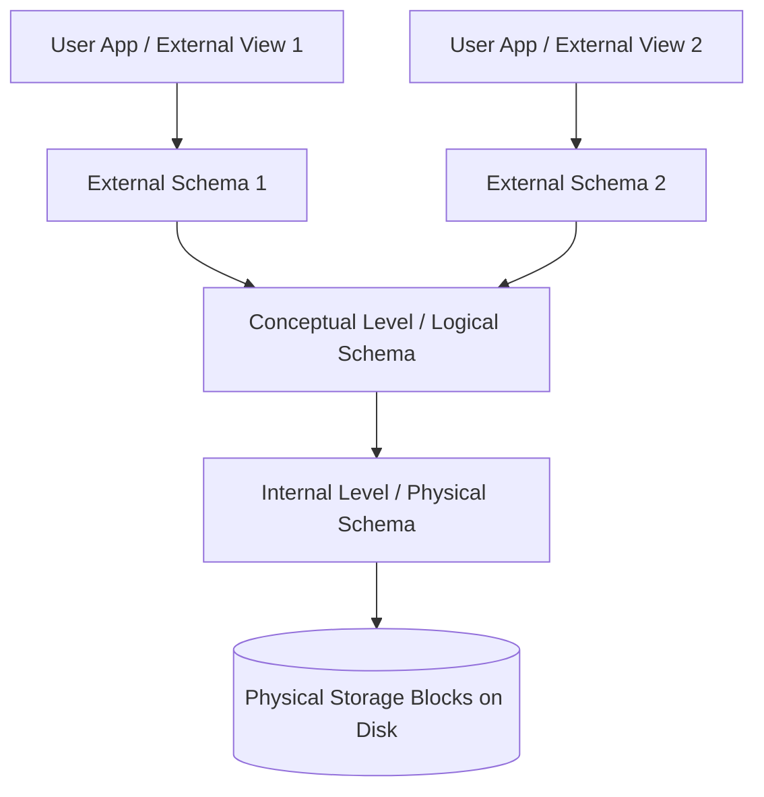
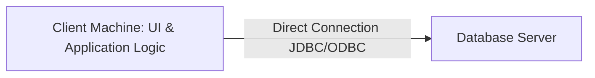
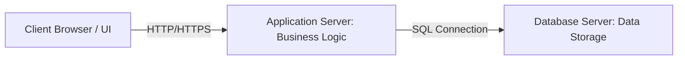

# Chapter 1: Introduction to DBMS & System Architecture (Lectures 1 - 15)

This chapter covers the foundational concepts of Database Management Systems, contrasts them with traditional file systems, and details schemas, levels of abstraction, data independence, architectures, and classifications.

---

## Lecture 1: Syllabus & Course Introduction

### 1. Real-World Analogy (Why DBMS is Needed)
*   **Manufacturing Example**: Consider a pen/pencil manufacturing company. Merely manufacturing the product is not enough. You must record and track detailed data for operations (e.g., length, color, manufacturing date, cost/price, QR/barcodes, and physical batch location).
*   **Handling Customer Complaints**: If a customer reports a faulty item, the company uses stored barcode data to trace the product back to its specific batch, production date, and raw material vendor to fix the root cause.
*   **Accountability & Transparency**: Storing structured historical data across all departments (HR, Accounts, Logistics, Sales, R&D) ensures operational transparency and organizational accountability.

### 2. Target Audience
*   **Undergraduate Students**: Computer Science (CS) and Information Technology (IT) engineering students taking university-level DBMS courses.
*   **Competitive Exam Aspirants**: Candidates preparing for examinations like GATE, ISRO, or technical PSU assessments.
*   **Career Aspirants**: Individuals seeking positions in data engineering, backend software development, Data Analysis, or Business Analysis.

### 3. Syllabus Overview (14 Core Chapters)
The curriculum is organized into 14 key chapters:
1.  Introduction to RDBMS
2.  Relational Database Concepts
3.  Database Design & ER Model
4.  Basics of SQL
5.  Advanced SQL Features (Procedures, Triggers, Functions)
6.  Formal Relational Query Languages & Relational Algebra
7.  Normalization & Functional Dependencies
8.  Storage and File Structures
9.  Indexing and Hashing
10. Query Processing & Optimization
11. Transactions & Concurrency Control
12. Database System Architectures
13. Data Warehousing & Data Mining
14. XML & Advanced Databases

### 4. Career Opportunities (Scope)
*   **Database Administrator (DBA)**: Complete privilege, maintenance, tuning, and access control over database systems.
*   **Full Stack Developer / Backend Developer**: Core database knowledge needed to build APIs and backend application structures.
*   **Other Roles**: Data Analyst, Business Analyst, Software Tester, and Security/Penetration Tester.

---

## Lecture 2: Introduction to Database & DBMS

### 1. Definition of DBMS
*   **Core Definition**: A Database Management System (DBMS) is a collection of interrelated data and a set of programs to access (retrieve) those data.
*   **Interrelated Data**: Data is stored in structured formats (such as tables with rows and columns) where the data in a particular row is logically connected to a specific item or real-world entity.
*   **Storage and Access**: A DBMS is not just for storing data permanently—it provides a set of programs to retrieve or fetch that data conveniently and efficiently (e.g., retrieving account details instantly at an ATM machine).

### 2. Key Features and Goals of DBMS
*   **Convenience and Efficiency**: DBMS provides convenient and efficient ways to store and retrieve data compared to traditional file systems.
*   **Handling Large Volumes of Data**: It is designed to manage massive amounts of data for organizations while keeping track of all changes and concurrent transactions.
*   **Data Storage Structures**: Defines simple or complex data structures capable of handling various types of data, including multimedia (audio, video, animations).
*   **Data Manipulation**: Provides mechanisms to insert, update, or edit data accurately (e.g., updating a phone number or address).
*   **Safety and Security**: Protects sensitive data from unauthorized access, security threats, or system failures.

### 3. Difference Between Data and Information
*   **Data (Raw Facts)**: Unprocessed facts or raw information with no context.
    *   *Example*: `25, Raghav, Nagpur` (without context, these are just strings and numbers).
*   **Information (Processed Data)**: Data that has been processed, structured, and organized to give a meaningful context.
    *   *Example*: `"Raghav is 25 years old and resides in Nagpur."`

### 4. What is Metadata?
*   **Definition**: Metadata is data about data.
*   **Example**: For a document or media file stored on a system, the metadata includes the author's name, creation date, last modified date, and file size. For a database, it includes table definitions, data types, and primary key constraints.

---

## Lecture 3: Traditional File System vs. DBMS
*   **File System**: Data is stored in individual flat files (e.g., `.txt`, `.csv`) managed directly by the operating system. Each program is written with hard-coded file formats, meaning the application logic and data structure are tightly coupled.
*   **DBMS**: Data is stored centrally. The data definition (metadata) is stored in a catalog (data dictionary) separated from application code, creating an abstraction layer.

| Feature | Traditional File System | DBMS |
| :--- | :--- | :--- |
| **Data Structure** | Tightly coupled with the application program. | Stored independently in a system catalog. |
| **Redundancy** | High (same details stored across different departments). | Minimized through normalization and joins. |
| **Concurrency** | Difficult to lock specific records; files are locked. | Granular locks (row/page/table level) via transactions. |
| **Security** | Coarse-grained OS-level file permissions. | Fine-grained roles, views, and row-level access control. |

---

## Lecture 4: Drawbacks of Traditional File System
1.  **Data Redundancy & Inconsistency**: The same data is stored multiple times in different places.
    *   *Redundancy Example*: Student Address is stored in both the `Hostel_Records` file and the `Academic_Records` file.
    *   *Inconsistency Example*:
        
        **Hostel_Records File:**
        | Student_ID | Name | Address |
        | :--- | :--- | :--- |
        | S101 | John Doe | 123 Main St, NY |

        **Academic_Records File (Failed to update when student moved):**
        | Student_ID | Name | Address |
        | :--- | :--- | :--- |
        | S101 | John Doe | 456 Oak Ave, CA |

2.  **Data Isolation**: Data is scattered across multiple files in different formats. Writing new applications to retrieve correct data is extremely difficult.
3.  **Integrity Problems**: Data values must satisfy constraints (e.g., `Account_Balance >= 0`). In a file system, these checks are hard-coded in the application program. Adding new constraints requires rewriting the code.
4.  **Concurrent Access Anomalies**: Multiple users accessing the same file concurrently can cause data corruption (e.g., booking the same airline seat simultaneously).
5.  **Security Problems**: It is difficult to restrict users to specific subsets of data (e.g., allowing a secretary to view student contact info but not marks).

---

## Lecture 5: Key Characteristics of DBMS
*   **Self-Describing Database System**: The database contains both the actual database records and a catalog defining the structure of all files, data types, and constraints.
*   **Insulation Between Programs and Data (Program-Data Independence)**: The structure of data files is stored in the DBMS catalog separately from the application programs. Changes to the physical structure of a file do not require rewriting the applications.
*   **Data Abstraction**: The DBMS provides a conceptual representation of data to users, hiding physical storage details (like block layouts or index paths).
*   **Support of Multiple Views of the Data**: Different users can see different representations of the same underlying data (e.g., a student sees their GPA, while the registrar sees full mark transcripts).
*   **Sharing of Data and Multi-User Transaction Processing**: Allows concurrent transactions to run safely while preserving ACID rules.

---

## Lecture 6: Database Users & Database Administrator (DBA)
1.  **Database Administrator (DBA)**: Responsible for authorizing access, monitoring usage, tuning performance, schema creation, and coordinate backing up/recovering databases.
2.  **Naive / Parametric Users**: Interact with the system through pre-written application interfaces (e.g., bank tellers, airline reservation clerks, e-commerce customers).
3.  **Sophisticated Users**: Engineers, analysts, or scientists who write complex database queries directly in SQL to perform custom reporting and data mining.
4.  **Application Programmers**: Software developers who write programs (e.g., in Java, Python, C#) that execute database transactions.

---

## Lecture 7: Database Languages (DDL, DML, DCL, TCL)
*   **DDL (Data Definition Language)**: Used by DBAs and designers to define schemas and constraints. The DDL compiler generates metadata stored in the data dictionary.
    *   *Commands*: `CREATE`, `ALTER`, `DROP`, `TRUNCATE`.
*   **DML (Data Manipulation Language)**: Used to query, insert, update, and delete database records.
    *   *Procedural DML*: User specifies *what* data is needed and *how* to get it (e.g., Relational Algebra).
    *   *Non-Procedural DML*: User specifies *what* data is needed without describing how to get it (e.g., SQL).
*   **DCL (Data Control Language)**: Used to configure permissions and authorizations (`GRANT`, `REVOKE`).
*   **TCL (Transaction Control Language)**: Used to manage transaction execution states (`COMMIT`, `ROLLBACK`, `SAVEPOINT`).

---

## Lecture 8: Three-Schema Architecture (Levels of Abstraction)
This architecture separates the user application interfaces from the physical database files to ensure data independence.

1.  **External Level / External Schema**: Describes the part of the database that a specific user group is interested in, hiding the rest of the database structure.
2.  **Conceptual Level / Conceptual Schema**: Describes the logical structure of the entire database (entities, attributes, relationships, constraints). It hides the physical storage details.
3.  **Internal Level / Internal Schema**: Describes the physical storage structure of the database (physical block sizes, file paths, record clustering, indexes).

---

## Lecture 9: Physical Data Independence
*   **Concept**: The ability to modify the physical/internal schema without affecting the conceptual schema or the external applications.
*   **Usage**: If we move the database to a new hard drive, change index structures (e.g., from B+ Tree to Hash index), or partition a file, the logical tables remain unchanged. The application code executing queries continues to work without modification.

---

## Lecture 10: Logical Data Independence
*   **Concept**: The ability to modify the conceptual schema (logical table structures, constraints) without changing the external schemas or application programs.
*   **Usage**: If we split an existing table into two or add a new attribute to a relation, we can define a view that reconstructs the old table structure. This ensures that old application programs referencing the table do not break.

---

## Lecture 11: Schema Mappings
*   **Concept**: The process of transforming requests and results between different levels of the three-schema architecture.
*   **Conceptual-to-Internal Mapping**: Translates conceptual queries (e.g., `SELECT * FROM student`) into internal disk block operations and index searches.
*   **External-to-Conceptual Mapping**: Translates user-view queries on virtual views into queries on the actual logical tables.
*   **Importance**: When a schema at one level changes, only the mapping to the adjacent level needs modification. The schemas at other levels remain untouched.

---

## Lecture 12: Database Architectures Overview
*   **Centralized DBMS Architecture**: All database software, data storage, and processing client programs run on a single machine (e.g., a mainframe server). Easy to manage but creates performance bottlenecks.
*   **Client-Server DBMS Architecture**: Workloads are distributed between the client machine (runs user interface and local application logic) and the database server machine (handles query optimization, transactional safety, and disk storage).

---

## Lecture 13: 2-Tier Architecture
*   **Concept**: The client application runs directly on the user's machine and communicates directly with the database server using network connection protocols (e.g., JDBC or ODBC).

*   **Pros**: Direct and simple communication.
*   **Cons**:
    1.  **Security**: Database credentials (connection strings) are often stored in the client-side code, creating vulnerabilities.
    2.  **Maintenance**: If business logic changes, the client application must be updated on every user machine.

---

## Lecture 14: 3-Tier Architecture
*   **Concept**: An intermediate layer called the **Application Server** or **Web Server** is introduced between the Client and the Database Server.

*   **Layers**:
    1.  **Presentation Layer**: The UI running on the client machine (e.g., web browser).
    2.  **Application Layer / Business Logic**: Processes validation rules, calculates inputs, and coordinates data flow.
    3.  **Database Layer**: Executes SQL transactions and manages storage.
*   **Pros**: Highly secure (database credentials are kept on the secure application server), highly scalable, and easy to deploy updates since business logic is centralized.

---

## Lecture 15: Classification of DBMS
DBMS systems can be categorized based on their underlying data model:
1.  **Relational DBMS (RDBMS)**: Organizes data as a collection of two-dimensional tables (relations) with rows and columns. (e.g., PostgreSQL, MySQL, Oracle).
2.  **Object-Oriented DBMS (OODBMS)**: Stores data in the form of objects, matching Object-Oriented Programming (OOP) languages (e.g., db4o, ObjectDB).
3.  **Hierarchical DBMS**: Organizes data in a parent-child tree structure. A child node can have only one parent node (e.g., IBM Information Management System).
4.  **Network DBMS**: Organizes data in a graph structure. Unlike hierarchical models, a child node can have multiple parent nodes (e.g., Integrated Data Store).
