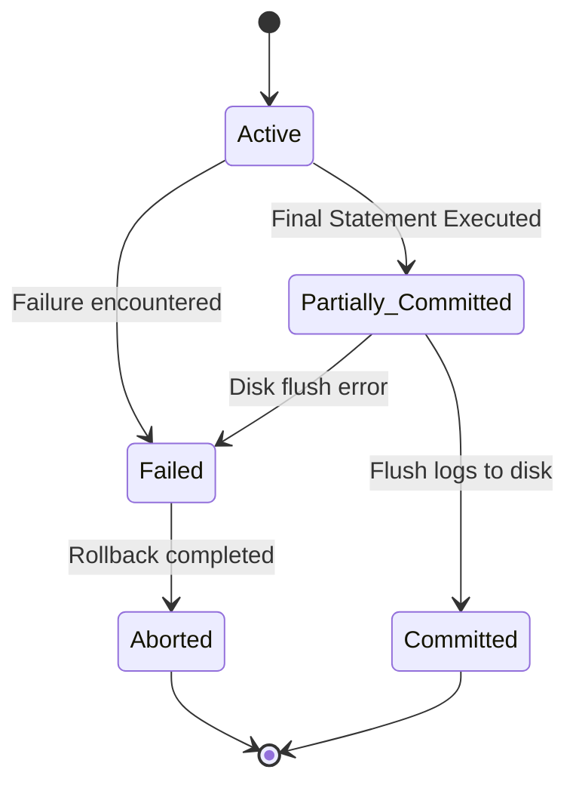

# Chapter 5: Transactions & Concurrency Control (Lectures 78 - 87)

This chapter explains the concepts of transaction processing, ACID execution properties, schedules classification, serializability algorithms, recoverability constraints, and concurrency control locking protocols.

---

## Video 78: Introduction to Transactions & ACID properties
### English
*   **Transaction**: A logical unit of database processing that includes one or more database access operations (read, write, insert, delete).
*   **Need**: Prevents data loss during system failures and maintains correctness during simultaneous access by multiple users.

### Tamil (தமிழ்)
*   **பரிவர்த்தனை (Transaction)**: டேட்டாபேஸில் செய்யப்படும் ஒரு தொகுதி வேலை (உதாரணம்: வங்கியில் பணத்தை ஒரு கணக்கிலிருந்து மற்றொரு கணக்கிற்கு மாற்றுவது - இதில் Read மற்றும் Write செயல்கள் இருக்கும்).
*   **ஏன் தேவை?**: சிஸ்டம் திடீரென நின்றாலோ அல்லது பல பேர் ஒரே நேரத்தில் அணுகினாலோ தரவுகள் அழியாமல் பாதுகாக்க.

---

## Video 79: ACID Properties Deep-Dive
### English
To ensure database integrity, transactions must satisfy the **ACID** properties:
1.  **Atomicity**: "All or nothing." Either the entire transaction succeeds, or it is completely rolled back. Managed by the **Recovery Manager** (using logs).
2.  **Consistency**: A transaction must transform the database from one consistent state to another consistent state. Managed by the **Application Programmer** and constraints.
3.  **Isolation**: Execution of a transaction must be insulated from other concurrent transactions. Managed by the **Concurrency Control Manager**.
4.  **Durability**: Once committed, changes survive any subsequent system failures. Managed by the **Recovery Manager**.

### Tamil (தமிழ்)
*   **ACID பண்புகள் (முக்கியமான இன்டர்வியூ கேள்வி)**:
  1. **அணுத்தன்மை (Atomicity)**: "முழுமையாக நடக்கும் அல்லது எதுவுமே நடக்காது." பாதி வேலை நடந்த நிலையில் பரிவர்த்தனை நிற்கக் கூடாது (நின்றால் பழைய நிலைக்குத் திரும்பும் - Rollback).
  2. **சீரான தன்மை (Consistency)**: பரிவர்த்தனைக்கு முன்பும் பின்பும் கணக்கின் மொத்த தொகை மாறாமல் சரியாக இருக்க வேண்டும்.
  3. **தனிமைப்படுத்தல் (Isolation)**: ஒரு பரிவர்த்தனை நடக்கும்போது மற்றொன்று குறுக்கிடக் கூடாது.
  4. **நீடித்து நிலைத்தல் (Durability)**: சேமிக்கப்பட்ட தரவு மின்சாரம் துண்டிக்கப்பட்டாலும் அழியாமல் இருக்கும்.

---

## Video 80: Transaction State Transition Diagram
### English
*   **Active**: Initial state; transaction is executing read/write operations.
*   **Partially Committed**: After the final statement has been executed, but before changes are written to disk.
*   **Committed**: After successful completion; changes are permanently written to disk.
*   **Failed**: After discovery that normal execution can no longer proceed.
*   **Aborted**: After the transaction has been rolled back and the database restored to its prior state.

### Tamil (தமிழ்)
*   **பரிவர்த்தனை நிலைகள் (States)**:
  * **Active**: இயங்கிக் கொண்டிருக்கும் தொடக்க நிலை.
  * **Partially Committed**: கடைசி வரி இயங்கி முடித்த நிலை (வட்டில் இன்னும் சேமிக்கப்படவில்லை).
  * **Committed**: தரவு வெற்றிகரமாக வட்டில் சேமிக்கப்பட்ட நிலை.
  * **Failed**: பிழை ஏற்பட்டு நின்றுபோன நிலை.
  * **Aborted**: பழைய நிலைக்கு டேட்டாபேஸ் மாற்றப்பட்ட நிலை (Rollback).

---

## Video 81: Database Schedules: Serial, Non-Serial, Concurrent
### English
*   **Schedule**: A sequence of operations from a set of concurrent transactions preserving the chronological order of operations in each individual transaction.
*   **Serial Schedule**: Transactions are executed sequentially, one after another (no interleaving of operations). Always consistent.
*   **Non-Serial / Concurrent Schedule**: Operations of different transactions are interleaved. Can lead to inconsistencies if not controlled.

### Tamil (தமிழ்)
*   **அட்டவணை (Schedules)**:
  * பல பரிவர்த்தனைகள் ஒரே நேரத்தில் ஓடும்போது அவற்றின் கட்டளைகள் எந்த வரிசையில் இயங்குகின்றன என்ற காலவரிசைப் பட்டியல்.
  * **Serial**: ஒரு பரிவர்த்தனை முழுமையாக முடிந்த பிறகே அடுத்தது தொடங்கும் (எப்போதும் பாதுகாப்பானது).
  * **Non-Serial**: கட்டளைகள் மாறி மாறி இயங்குவது (வேகமானது ஆனால் ஆபத்தானது).

---

## Video 82: Conflict Serializability Concept
### English
*   **Conflict Serializability**: A schedule is conflict serializable if it is conflict equivalent to some serial schedule.
*   **Conflicting Operations**: Two operations in a schedule conflict if:
    1.  They belong to different transactions.
    2.  They access the exact same data item (e.g., $A$).
    3.  At least one of the operations is a write operation ($W(A)$).
    *   *Conflict pairs*: $R_i(A)$ and $W_j(A)$, $W_i(A)$ and $R_j(A)$, $W_i(A)$ and $W_j(A)$ (where $i \ne j$).

### Tamil (தமிழ்)
*   **முரண்பாடு தொடராக்கம் (Conflict Serializability)**:
  * ஒரு மாற்று அட்டவணை (Non-serial) இயங்கும்போது அது ஏதேனும் ஒரு தொடர் அட்டவணைக்கு (Serial schedule) சமமாக இருக்கிறதா என்று பார்ப்பது.
  * **முரண்படும் கட்டளைகள் (Conflict)**: வேறு வேறு பரிவர்த்தனைகள், ஒரே தரவை அணுகி, அவற்றில் ஒன்று எழுதப்படும் (Write) செயலாக இருந்தால் முரண்பாடு ஏற்படும் (எ.கா: $W_1(A)$ மற்றும் $R_2(A)$).

---

## Video 83: Conflict Equivalence of Schedules
### English
*   **Concept**: Two schedules $S_1$ and $S_2$ are conflict equivalent if they involve the same transactions and operations, and the order of any two conflicting operations is the same in both schedules.
*   **Rule**: Non-conflicting operations can be swapped to transform a schedule into a serial one.

### Tamil (தமிழ்)
*   **முரண்பாட்டுச் சமநிலை**:
  * முரண்படாத கட்டளைகளை இடம் மாற்றுவதன் (Swapping) மூலம் ஒரு அட்டவணையைத் தொடர் அட்டவணையாக மாற்ற முடிந்தால் அது சமநிலை உடையது.

---

## Video 84: Precedence Graphs for Conflict Serializability
### English
An algorithmic method to check if a schedule $S$ is conflict serializable.
*   **Algorithm**:
    1.  Create a node for each transaction $T_i$ in the schedule.
    2.  Draw a directed edge from $T_i \rightarrow T_j$ if there is a conflicting operation in $T_i$ that occurs before a conflicting operation in $T_j$.
    3.  **Result**: If the precedence graph has **no cycles**, the schedule is conflict serializable. If a cycle exists, it is not.
    4.  **Topological Sort** of the graph gives the equivalent serial schedule order.

*(If no back-edges exist, the graph is acyclic and serializable).*

### Tamil (தமிழ்)
*   **முன்னுரிமை வரைபடம் (Precedence Graph)**:
  * சர்க்யூட் (Cycle) இருக்கிறதா என்று சோதிக்கும் வரைபடம்.
  * **வழிமுறை**:
    1. ஒவ்வொரு பரிவர்த்தனைக்கும் ஒரு புள்ளி (Node) வைக்கவும்.
    2. முரண்படும் செயல் முதலில் $T_i$-லும் அடுத்து $T_j$-லும் நடந்தால், $T_i \rightarrow T_j$ என்று கோடு வரையவும்.
    3. **முடிவு**: வரைபடத்தில் **வளையம் (Cycle) இல்லை என்றால்** அது Conflict Serializable ஆகும்.

---

## Video 85: View Serializability
### English
*   **Concept**: A schedule is view serializable if it is view equivalent to some serial schedule.
*   **View Equivalence Conditions**: Let $S$ and $S'$ be two schedules with same transactions:
    1.  **Initial Read**: If $T_i$ reads the initial value of $A$ in $S$, it must do so in $S'$.
    2.  **Dirty Read / Produced Value**: If $T_i$ reads a value of $A$ written by $T_j$ in $S$, it must do so in $S'$.
    3.  **Final Write**: If $T_i$ performs the final write on $A$ in $S$, it must do so in $S'$.
*   **Note**: Every conflict serializable schedule is also view serializable, but the reverse is not always true.

### Tamil (தமிழ்)
*   **பார்வை தொடராக்கம் (View Serializability)**:
  * மூன்று விதிகளை அடிப்படையாகக் கொண்டது:
    1. **ஆரம்ப வாசிப்பு (Initial Read)**: முதலில் வாசிக்கும் நபர் மாறக் கூடாது.
    2. **இடைநிலை வாசிப்பு (Dirty Read)**: ஒருவரால் எழுதப்பட்டதை அடுத்தவர் வாசிக்கும் முறை மாறக் கூடாது.
    3. **இறுதி எழுத்து (Final Write)**: கடைசியாக மாற்றி அமைக்கும் நபர் மாறக் கூடாது.

---

## Video 86: Schedule Recoverability
### English
*   **Recoverable Schedule**: If transaction $T_j$ reads a value written by $T_i$ (dirty read dependency), the commit operation of $T_i$ must appear before the commit operation of $T_j$.
    \[C_i < C_j\]
*   **Cascadeless Schedule**: A transaction $T_j$ is only allowed to read values written by $T_i$ *after* $T_i$ has committed. Avoids cascading rollbacks.
*   **Strict Schedule**: A transaction is not allowed to read or write a data item until the last transaction that wrote it commits or aborts.

### Tamil (தமிழ்)
*   **மீட்கக்கூடிய அட்டவணைகள் (Recoverability)**:
  * **Recoverable**: $T_2$ என்பது $T_1$ எழுதியதை வாசித்தால், $T_1$ முதலில் கமிட் (Commit) செய்ய வேண்டும், அதன் பிறகே $T_2$ கமிட் செய்ய வேண்டும்.
  * **Cascadeless (அடுக்கற்றது)**: ஒரு பரிவர்த்தனை கமிட் செய்த பிறகே அதன் மதிப்பை அடுத்தவர் வாசிக்க வேண்டும். இதனால் ஒருவர் தோல்வியுற்றால் மற்ற அனைவரும் சேர்ந்து அழியும் நிலை (Cascading Rollback) தடுக்கப்படும்.

---

## Video 87: Concurrency Control Protocols (Locking & 2PL)
### English
*   **Locking**: Rules to restrict access to data items.
    *   **Shared Lock ($S$)**: For read-only operations. Multiple transactions can hold shared locks on the same item.
    *   **Exclusive Lock ($X$)**: For write operations. Only one transaction can hold an exclusive lock.
*   **Two-Phase Locking (2PL)**: Guarantees serializability. Has two phases:
    1.  **Growing Phase**: Transaction may obtain locks, but cannot release any lock.
    2.  **Shrinking Phase**: Transaction may release locks, but cannot obtain any new locks.
*   **Variants**:
    *   **Strict 2PL**: Holds all exclusive ($X$) locks until the transaction commits/aborts.
    *   **Rigorous 2PL**: Holds all locks ($S$ and $X$) until commit/abort.

### Tamil (தமிழ்)
*   **பூட்டுதல் நெறிமுறைகள் (2PL - Two Phase Locking)**:
  * பரிவர்த்தனை பாதுகாப்பாக இயங்க டேட்டாவைப் பூட்டி வைக்கும் முறை.
    * **பகிர்வுப் பூட்டு (Shared - S)**: வாசிக்க மட்டும் பயன்படும் (பலர் ஒரே நேரத்தில் பூட்டலாம்).
    * **தனிப் பூட்டு (Exclusive - X)**: எழுதப் பயன்படும் (ஒருவர் மட்டுமே பூட்ட முடியும்).
  * **2-Phase Locking (2PL)**:
    1. **வளரும் நிலை (Growing)**: பூட்டுகளைப் பெறலாம், ஆனால் எதையும் ரிலீஸ் செய்யக் கூடாது.
    2. **சுருங்கும் நிலை (Shrinking)**: பூட்டுகளை ரிலீஸ் செய்யலாம், ஆனால் புதிய பூட்டுகளைப் பெறக் கூடாது.
