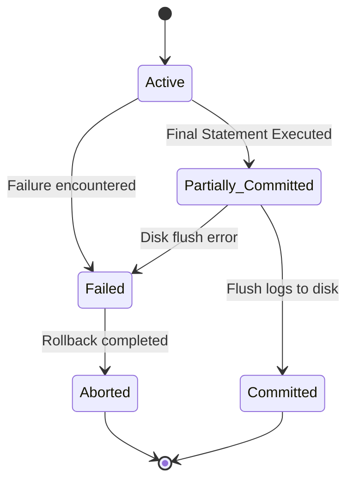

# Chapter 5: Transactions & Concurrency Control (Lectures 78 - 87)

This chapter explains the concepts of transaction processing, ACID execution properties, schedules classification, serializability algorithms, recoverability constraints, and concurrency control locking protocols.

---

## Lecture 78: Introduction to Transactions & ACID properties
*   **Transaction**: A logical unit of database processing that includes one or more database access operations (read, write, insert, delete).
*   **Need**: Prevents data loss during system failures and maintains correctness during simultaneous access by multiple users.

---

## Lecture 79: ACID Properties Deep-Dive
To ensure database integrity, transactions must satisfy the **ACID** properties:
1.  **Atomicity**: "All or nothing." Either the entire transaction succeeds, or it is completely rolled back. Managed by the **Recovery Manager** (using logs).
2.  **Consistency**: A transaction must transform the database from one consistent state to another consistent state. Managed by the **Application Programmer** and constraints.
3.  **Isolation**: Execution of a transaction must be insulated from other concurrent transactions. Managed by the **Concurrency Control Manager**.
4.  **Durability**: Once committed, changes survive any subsequent system failures. Managed by the **Recovery Manager**.

---

## Lecture 80: Transaction State Transition Diagram
*   **Active**: Initial state; transaction is executing read/write operations.
*   **Partially Committed**: After the final statement has been executed, but before changes are written to disk.
*   **Committed**: After successful completion; changes are permanently written to disk.
*   **Failed**: After discovery that normal execution can no longer proceed.
*   **Aborted**: After the transaction has been rolled back and the database restored to its prior state.

---

## Lecture 81: Database Schedules: Serial, Non-Serial, Concurrent
*   **Schedule**: A sequence of operations from a set of concurrent transactions preserving the chronological order of operations in each individual transaction.
*   **Serial Schedule**: Transactions are executed sequentially, one after another (no interleaving of operations). Always consistent.
*   **Non-Serial / Concurrent Schedule**: Operations of different transactions are interleaved. Can lead to inconsistencies if not controlled.

---

## Lecture 82: Conflict Serializability Concept
*   **Conflict Serializability**: A schedule is conflict serializable if it is conflict equivalent to some serial schedule.
*   **Conflicting Operations**: Two operations in a schedule conflict if:
    1.  They belong to different transactions.
    2.  They access the exact same data item (e.g., $A$).
    3.  At least one of the operations is a write operation ($W(A)$).
    *   *Conflict pairs*: $R_i(A)$ and $W_j(A)$, $W_i(A)$ and $R_j(A)$, $W_i(A)$ and $W_j(A)$ (where $i \ne j$).

---

## Lecture 83: Conflict Equivalence of Schedules
*   **Concept**: Two schedules $S_1$ and $S_2$ are conflict equivalent if they involve the same transactions and operations, and the order of any two conflicting operations is the same in both schedules.
*   **Rule**: Non-conflicting operations can be swapped to transform a schedule into a serial one.

---

## Lecture 84: Precedence Graphs for Conflict Serializability
An algorithmic method to check if a schedule $S$ is conflict serializable.
*   **Algorithm**:
    1.  Create a node for each transaction $T_i$ in the schedule.
    2.  Draw a directed edge from $T_i \rightarrow T_j$ if there is a conflicting operation in $T_i$ that occurs before a conflicting operation in $T_j$.
    3.  **Result**: If the precedence graph has **no cycles**, the schedule is conflict serializable. If a cycle exists, it is not.
    4.  **Topological Sort** of the graph gives the equivalent serial schedule order.

**Concurrent Schedule Example Table:**
| Time | Transaction 1 ($T_1$) | Transaction 2 ($T_2$) |
| :--- | :--- | :--- |
| t1 | Read(A) | |
| t2 | | Read(A) |
| t3 | Write(A) | |
| t4 | | Write(A) |

*   *Analysis*: 
    *   $R_1(A)$ conflicts with $W_2(A)$ (T1 precedes T2 $\rightarrow$ Edge: $T_1 \rightarrow T_2$).
    *   $R_2(A)$ conflicts with $W_1(A)$ (T2 precedes T1 $\rightarrow$ Edge: $T_2 \rightarrow T_1$).
*   *Result*: Graph has cycle $T_1 \leftrightarrow T_2$. Therefore, this schedule is **not** conflict serializable.

---

## Lecture 85: View Serializability
*   **Concept**: A schedule is view serializable if it is view equivalent to some serial schedule.
*   **View Equivalence Conditions**: Let $S$ and $S'$ be two schedules with same transactions:
    1.  **Initial Read**: If $T_i$ reads the initial value of $A$ in $S$, it must do so in $S'$.
    2.  **Dirty Read / Produced Value**: If $T_i$ reads a value of $A$ written by $T_j$ in $S$, it must do so in $S'$.
    3.  **Final Write**: If $T_i$ performs the final write on $A$ in $S$, it must do so in $S'$.
*   **Note**: Every conflict serializable schedule is also view serializable, but the reverse is not always true.

---

## Lecture 86: Schedule Recoverability
*   **Recoverable Schedule**: If transaction $T_j$ reads a value written by $T_i$ (dirty read dependency), the commit operation of $T_i$ must appear before the commit operation of $T_j$.
    \[C_i < C_j\]
*   **Cascadeless Schedule**: A transaction $T_j$ is only allowed to read values written by $T_i$ *after* $T_i$ has committed. Avoids cascading rollbacks.
*   **Strict Schedule**: A transaction is not allowed to read or write a data item until the last transaction that wrote it commits or aborts.

**Recoverable vs Non-Recoverable Schedule Table:**

*Non-Recoverable Schedule:*
| Transaction 1 ($T_1$) | Transaction 2 ($T_2$) | Status |
| :--- | :--- | :--- |
| Write(A) | | |
| | Read(A) | $T_2$ reads dirty data |
| | Commit | **$T_2$ commits first** |
| Abort | | **T1 aborts! T2 committed invalid data!** |

*Recoverable Schedule (C1 must precede C2):*
| Transaction 1 ($T_1$) | Transaction 2 ($T_2$) | Status |
| :--- | :--- | :--- |
| Write(A) | | |
| | Read(A) | |
| Commit | | **$T_1$ commits first** |
| | Commit | **$T_2$ commits second (Safe)** |

---

## Lecture 87: Concurrency Control Protocols (Locking & 2PL)
*   **Locking**: Rules to restrict access to data items.
    *   **Shared Lock ($S$)**: For read-only operations. Multiple transactions can hold shared locks on the same item.
    *   **Exclusive Lock ($X$)**: For write operations. Only one transaction can hold an exclusive lock.
*   **Two-Phase Locking (2PL)**: Guarantees serializability. Has two phases:
    1.  **Growing Phase**: Transaction may obtain locks, but cannot release any lock.
    2.  **Shrinking Phase**: Transaction may release locks, but cannot obtain any new locks.
*   **Variants**:
    *   **Strict 2PL**: Holds all exclusive ($X$) locks until the transaction commits/aborts.
    *   **Rigorous 2PL**: Holds all locks ($S$ and $X$) until commit/abort.
